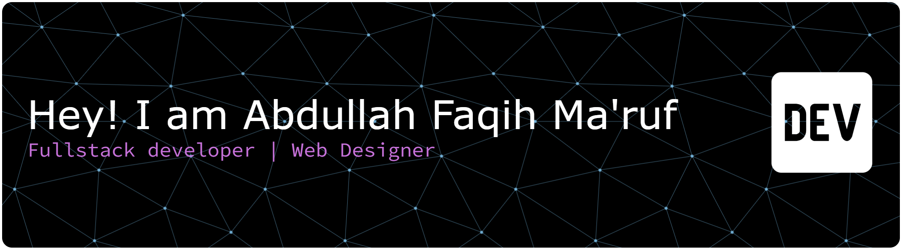

<h3 align="center" style=""><b>About Me 👀</b></h3>
    

      I'm Fullstack Developer proficient in laravel 🚀  I want to persue my Software Engineer grade   Make an efficient features   I have been a programmer for 2 years 🎧  Listening to spotify when coding is my booster feeling

<h3 align="center"><b>Connect with me</b> ✉️</h3>

    
    
    
    
    
     
    
    

###

  
  

###

###

###
<!--
**faqih4php/faqih4php** is a ✨ _special_ ✨ repository because its `README.md` (this file) appears on your GitHub profile.

Here are some ideas to get you started:

- 🔭 I’m currently working on ...
- 🌱 I’m currently learning ...
- 👯 I’m looking to collaborate on ...
- 🤔 I’m looking for help with ...
- 💬 Ask me about ...
- 📫 How to reach me: ...
- 😄 Pronouns: ...
- ⚡ Fun fact: ...
-->
